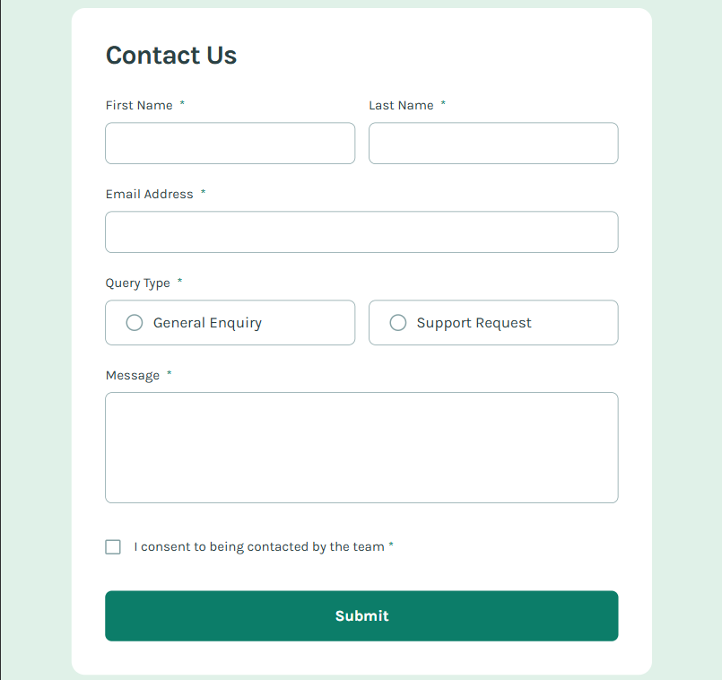

# Contact Form
 
An accessible, fully validated contact form — built from a [Frontend Mentor](https://www.frontendmentor.io/) challenge, matched pixel-for-pixel to the provided Figma design.
 
🔗 **[Live demo](https://karolinamas.github.io/contact-form/)**

## Screenshot

 
## The challenge
 
Build a contact form that's as close to the design as possible, with a strong focus on accessibility. Users should be able to:
 
- Complete the form and see a success toast message on successful submission
- Get form validation messages when:
  - A required field is missed
  - The email address isn't formatted correctly
- Complete the entire form using only the keyboard
- Have inputs, error messages, and the success message announced by a screen reader
- View an optimal layout depending on their device's screen size
- See hover and focus states for all interactive elements
All of the above is implemented, matching the Figma design exactly.
 
## What I focused on
 
- **Accessibility (a11y)** — proper labels, `aria-live` regions for the success toast and validation messages, logical focus order, and full keyboard-only operation
- **Form validation** — handled with React Hook Form, including required-field checks and email format validation, with clear inline error messages
- **Pixel-accurate implementation** — matched spacing, typography, and states (hover/focus) to the provided Figma design
- **Responsive layout** — adapts cleanly across screen sizes
## Tech stack
 
- React
- TypeScript
- React Hook Form
## Running locally
 
```bash
git clone https://github.com/KarolinaMas/contact-form.git
cd contact-form
npm install
npm run dev
```
 
## Acknowledgments
 
Challenge by [Frontend Mentor](https://www.frontendmentor.io/) — design and requirements provided by them; implementation is my own.
